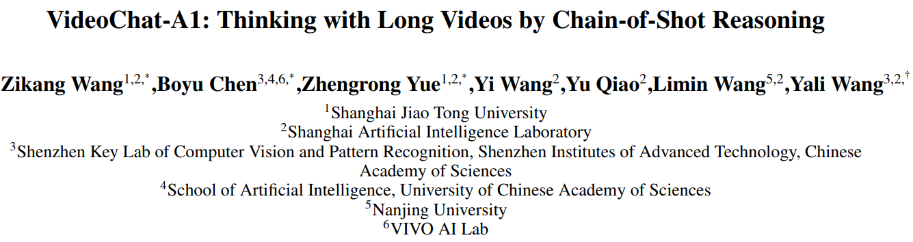
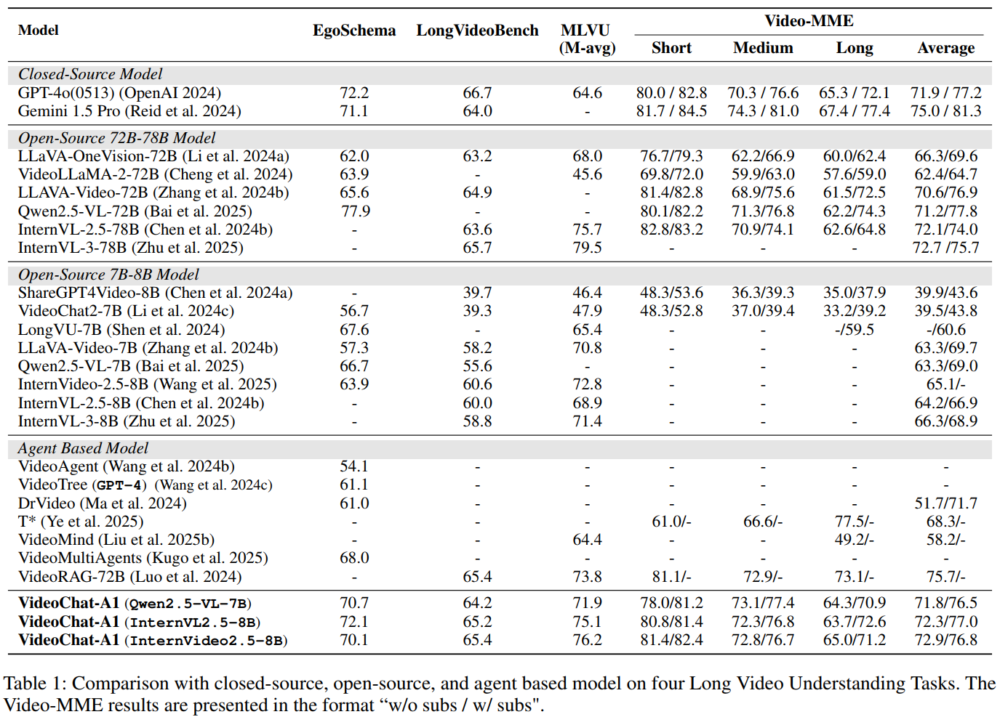
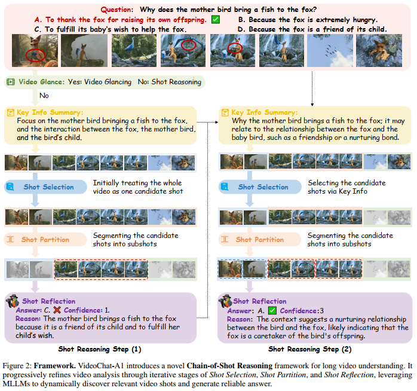

# VideoChat-A1：

Our paper has been accepted by AAAI 2025

## Abstract


Recent advances in video understanding have been driven by MLLMs. But these MLLMs are good at analyzing short videos, while suffering from difficulties in understanding videos with a longer context.To address this difficulty, several agent paradigms have recently been proposed, using MLLMs as agents for retrieving extra contextual knowledge in a long video.

However,most existing agents ignore the key fact that a long video is composed with multiple shots,i.e.,to answer the user question from a long video, it is critical to deeply understand its relevant shots like human.Without such insight,these agents often mistakenly find redundant even noisy temporal context,restricting their capacity for long video understanding.
To fill this gap,we propose VideoChat-A1, a novel long video agent paradigm. Different from the previous works, our VideoChat-A1 can deeply think with long videos, via a distinct chain-of-shot reasoning paradigm. More specifically, it can progressively select the relevant shots of user question, and look into these shots in a coarse-to-fine partition.
By multi-modal reasoning along the shot chain, VideoChat-A1 can effectively mimic step-by-step human thinking process, allowing the interactive discovery of preferable temporal context for thoughtful understanding in long videos.

Extensive experiments show that, VideoChat-A1 achieves the state-of-the-art performance on the mainstream long video QA benchmarks, e.g., it achieves 77.0 on VideoMME(w/ subs) and 70.1 on EgoSchema,  outperforming its strong baselines (e.g., InternVL2.5-8B and InternVideo2.5-8B),
by up to 10.1% and 6.2%.  Compared to leading closed-source GPT-4o and Gemini 1.5 Pro,  VideoChat-A1 offers competitive accuracy, but only with 7% input frames and 12% inference time on average.

## Result:



## Reasoning Step:



## Install

```bash
conda create -n lvagent python=3.12
pip install -r requirement.txt
```

- Please download the dataset of longvideo bench, videomme, egoschema, mlvu dataset from hugging face
- Download the model Qwen2.5-VL-7B, Internvl-2.5-7B, InternVideo-2.5-8B from hugging face
- **Change the path in  final_lvbench.py, all_model_agent.py and  all_model_util**

## Citation

```bash

@article{wang2025videochat,
  title={VideoChat-A1: Thinking with Long Videos by Chain-of-Shot Reasoning},
  author={Wang, Zikang and Chen, Boyu and Yue, Zhengrong and Wang, Yi and Qiao, Yu and Wang, Limin and Wang, Yali},
  journal={arXiv preprint arXiv:2506.06097},
  year={2025},

@misc{chen2025videochatm1,
      title={VideoChat-M1: Collaborative Policy Planning for Video Understanding via Multi-Agent Reinforcement Learning}, 
      author={Boyu Chen and Zikang Wang and Zhengrong Yue and Kainan Yan and Chenyun Yu and Yi Huang and Zijun Liu and Yafei Wen and Xiaoxin Chen and Yang Liu and Peng Li and Yali Wang},
      year={2025},
}


@article{chen2025lvagent,
  title={Lvagent: Long video understanding by multi-round dynamical collaboration of mllm agents},
  author={Chen, Boyu and Yue, Zhengrong and Chen, Siran and Wang, Zikang and Liu, Yang and Li, Peng and Wang, Yali},
  journal={arXiv preprint arXiv:2503.10200},
  year={2025},


```

